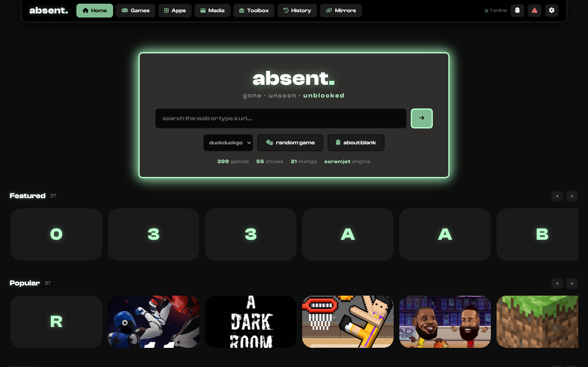
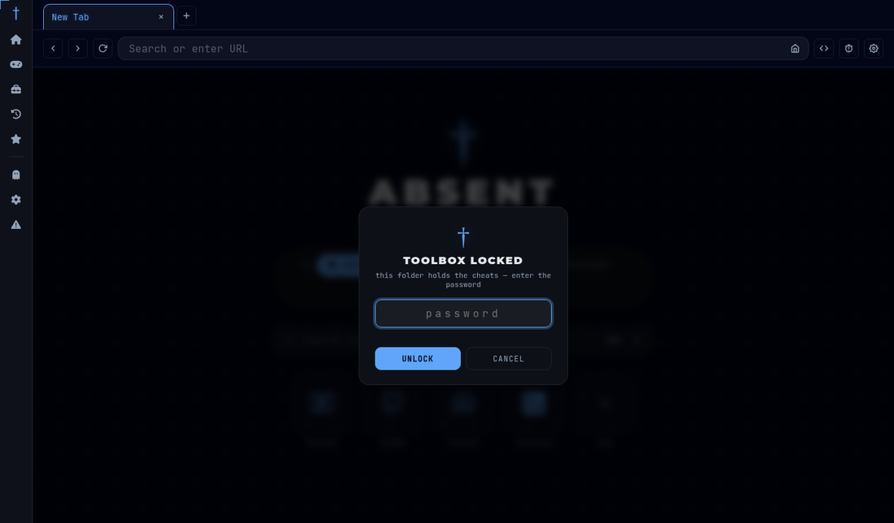
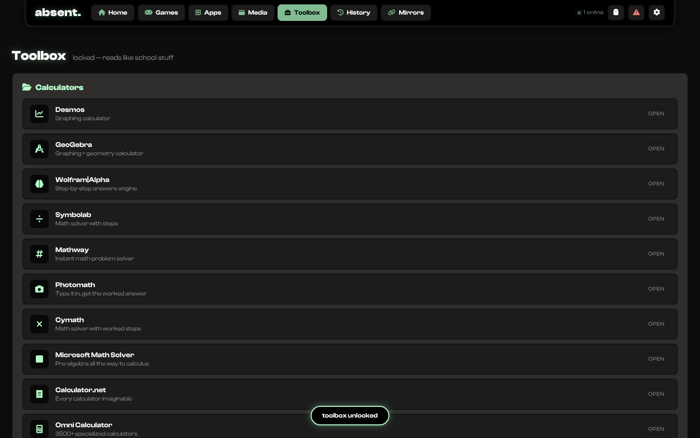
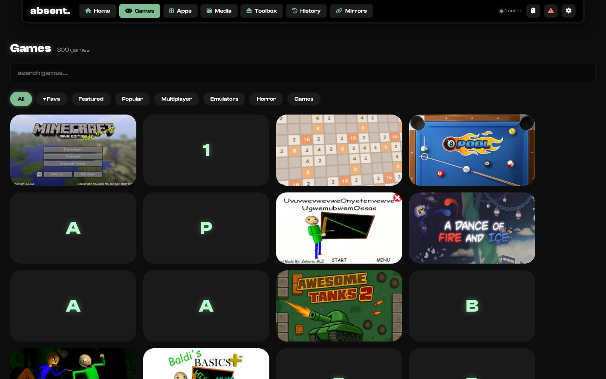
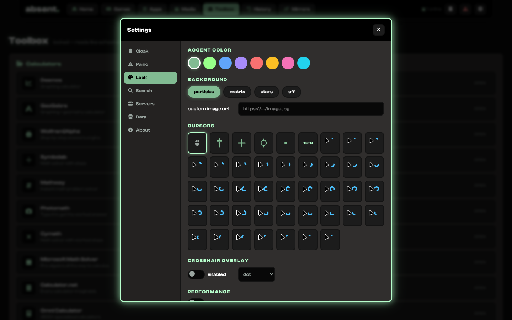
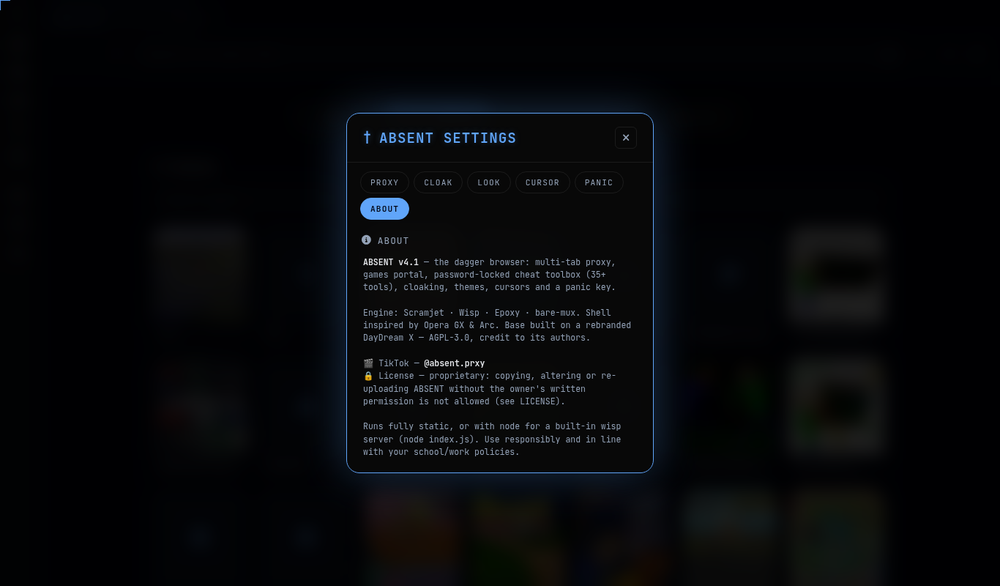

<div align="center">



# ! ABSENT

**A fast web proxy that looks and feels like a real browser — dagger-branded, flat-designed, and built on a fully rebranded [DayDream X](https://github.com/NxroProxy/DayDreamX) base. Run it static — or with node for a built-in WISP server.**

ABSENT v4.3 runs 100% in your browser — [Scramjet](https://github.com/MercuryWorkshop/scramjet) + [Epoxy transport](https://github.com/MercuryWorkshop/epoxy-transport) over WISP — wrapped in an Opera GX / Arc-style browser shell with **400+ games** on v3-style shelf rows (incl. **Roblox**), a **Spotify app**, a **password-locked toolbox (40+ tools)**, **tab cloaking**, cursor packs, a theme engine, history & bookmarks, multi-tab browsing, a **panic key**, and automatic low-latency server switching baked in.

[](https://github.com/UnblockableMan/absent)
[](#-license)
[](https://www.tiktok.com/@absent.prxy)

[](https://deploy.workers.cloudflare.com/?url=https://github.com/UnblockableMan/absent)
[](https://render.com/deploy?repo=https://github.com/UnblockableMan/absent)
[](https://vercel.com/new/clone?repository-url=https%3A%2F%2Fgithub.com%2FUnblockableMan%2Fabsent&project-name=absent)
[](https://app.netlify.com/start/deploy?repository=https://github.com/UnblockableMan/absent)

[](https://railway.com/new/template?template=https://github.com/UnblockableMan/absent)
[](https://app.koyeb.com/deploy?type=git&repository=github.com/UnblockableMan/absent&branch=main&builder=dockerfile)
[](https://heroku.com/deploy?template=https://github.com/UnblockableMan/absent)

</div>

---

## 📸 How ABSENT looks

<div align="center">

**The home menu — dagger title, tool belt, quick links, rotating footer**


**The Toolbox — password-locked, everything in folders**

<table>
<tr>
<td width="50%"><br><sub><b>🔒 Locked.</b> The cheat folder asks for the password (default <code>4349</code>) every session. Wrong guess = shake + denied.</sub></td>
<td width="50%"><br><sub><b>📁 Unlocked.</b> 35+ tools in collapsible folders: Calculators, Study Helpers, Quick Bookmarklets, Utilities — it reads like school stuff, not cheats.</sub></td>
</tr>
</table>

**396 games + full customization**



<table>
<tr>
<td width="50%"><br><sub><b>🎨 Settings → Look.</b> Themes, accent color, fonts, background images, crosshair overlay.</sub></td>
<td width="50%"><br><sub><b>† Settings → About.</b> Version info, TikTok, and the license notice.</sub></td>
</tr>
</table>

</div>

---

## ⚡ One-Click Deploy

ABSENT is **Cloudflare-first** — but every button below deploys the exact same static site. Fork this repo first, then replace `UnblockableMan/absent` in the URLs with your own fork if you want deploys under your account.

| Platform | Type | Cost | Notes |
|---|---|---|---|
| **Cloudflare Workers** ⭐ | Static assets on the edge | Free tier | Recommended — fastest, `wrangler.toml` included |
| **Render** | Static site | Free tier | `render.yaml` blueprint included |
| **Vercel** | Static | Free tier | Zero config |
| **Netlify** | Static | Free tier | `netlify.toml` included |
| **Railway** | Docker (nginx) | Trial | `Dockerfile` included |
| **Koyeb** | Docker (nginx) | Free tier | `Dockerfile` included |
| **Heroku** | Container | Paid | `app.json` + `Dockerfile` |

<details>
<summary><b>☁️ Deploy to GitHub Pages</b> (no button, 30 seconds)</summary>

1. Ask the owner for permission first — see [License](#-license). Unauthorized forks/re-uploads get taken down.
2. **Settings → Pages → Build and deployment → Source: Deploy from a branch**.
3. Pick branch `main`, folder `/ (root)`, **Save**.
4. Done — `https://<you>.github.io/absent/` is live.

</details>

<details>
<summary><b>🐳 Run locally</b></summary>

```bash
git clone https://github.com/UnblockableMan/absent
cd absent
python3 -m http.server 8080     # or: npx serve .
# open http://localhost:8080
```

Any static file server works — there is genuinely nothing to build.

</details>

<details>
<summary><b>🏃 Run with Node (built-in WISP server)</b></summary>

```bash
git clone https://github.com/UnblockableMan/absent
cd absent
npm install
npm start          # → http://localhost:8080
```

The node server (a rebranded DayDream X base) serves the same UI **plus** a real WISP endpoint on the same origin — open Proxy Settings → Custom Server and add `wss://<your-host>/wisp/` for a self-hosted, unblocked transport.

</details>

---

## 🔄 Infinite Links — the Worker Farm (free)

School blocked your link? Spawn more. Cloudflare's **free** plan runs up to **100 workers per account**, and every worker gets its own `absent-xxxxx.<your-sub>.workers.dev` link serving the exact same ABSENT. One account is enough — no team required.

**One-time setup (2 minutes):**

1. Make a free [Cloudflare](https://dash.cloudflare.com/sign-up) account (no card needed).
2. Top-right profile icon → **My Profile → API Tokens → Create Token** → use the **"Edit Cloudflare Workers"** template → Create → copy the token.

**Spawn links — Mac / Linux / Git Bash:**

```bash
export CLOUDFLARE_API_TOKEN=paste-your-token
bash tools/spawn-workers.sh 15      # 15 fresh links, saved to tools/links.txt
```

**Spawn links — Windows (plain cmd):**

```bat
set CLOUDFLARE_API_TOKEN=paste-your-token
tools\spawn-workers.bat 15
```

**Everyday upkeep:**

- Link gets blocked → `bash tools/spawn-workers.sh --delete absent-xxxxx` frees the slot, then spawn a fresh one.
- The **first** deploy uploads the whole site (a few minutes). After that Cloudflare skips unchanged files, so each extra worker is quick.
- `tools/links.txt` collects your links and is **gitignored** — your list never goes public.
- Free limits: ~100 workers and 100k requests/day per account — plenty for a school.
- ⚠️ If your school blocks **all** of `*.workers.dev` at once, the upgrade is the wildcard move: a cheap domain on Cloudflare with a `*.yourdomain.com` worker route — then every subdomain you invent is a fresh link.

---

## ✨ Features

- **◈ Fully static — or one-command node** — Scramjet + bare-mux + Epoxy/WISP all loaded client-side. Serve plain files from any host, or `node index.js` for the rebranded DayDream X Express base with a **built-in WISP server** at `wss://your-host/wisp/`.
- **🪟 Browser shell** — Opera GX / Arc-style UI: rounded tabs, utility bar and a **† tool-belt rail** (Home · Games · Toolbox · History · Saved · Cloak · Settings · Panic) always one click away.
- **🏠 New Tab = home menu** — the † dagger title, the tool belt below it, a live search bar and a footer that rotates the sayings (`w isaac` → `isaac the goat` → `brooklyn be good` → `absent 4 life` → `no se curly`).
- **🧰 Bigger Toolbox — 35+ tools in 4 folders** — collapsible 📁 sections, all behind the password:
  - **📁 Calculators (10)** — Desmos, GeoGebra, Wolfram\|Alpha, Symbolab, Mathway, Photomath, Cymath, Microsoft Math Solver, Calculator.net, Omni Calculator
  - **📁 Study Helpers (7)** — Kahoot Winner, Blooket Suite, SchoolCheats Hub, Quizit, Quizlet, Brainly, SparkNotes
  - **📁 Quick Bookmarklets (6)** — Blooket All-in-One, Edit Any Page, Reveal Passwords, Enable Right Click, Remove Blur, Dark Mode
  - **📁 Utilities (12)** — Code Editor, HTML Embedder, Website Embedder, History Flooder, Photopea, TinyWow, Temp Mail, Speed Test, Monkeytype, Azahar, Play.JS, Voxiles
- **🔒 Password-locked toolbox** — the cheat folder asks for a password (default **4349**) every session. Change it in Settings → Panic → Toolbox Lock. Wrong password = shake + denied.
- **🕵 Tab cloaking** — disguise the tab as Google / Classroom / Drive / Docs / New Tab, or set a custom title + favicon. **About:blank cloak** launches ABSENT inside a blank window (auto-launch on first click supported).
- **🖱 Cursor packs** — swap your cursor for a **dagger †**, cross, crosshair or dot — everywhere, including inside games. Plus a follow-mouse crosshair overlay with 12 styles for FPS aim.
- **🗂 Multi-tab browsing** — real proxy tabs with per-tab history and an inline New Tab page.
- **🚨 Panic key** — press your combo (e.g. `Ctrl+Shift+X`) and the whole tab is instantly *replaced* with your URL (e.g. Google Classroom). A red **PANIC NOW** button also lives on the belt.
- **📈 396 games, mostly self-hosted** — the full Cartel catalog bundled in (`assets/html/main/` + featured fullscreen loaders) plus the DayDream X catalog merged in (thumbs included), with instant search.
- **🕘 History & ★ Saved** — every page you visit is recorded locally; double-tap the ★ belt button to bookmark the current page.
- **🎨 Way more customization** — 4 theme palettes, custom accent color, 5 UI fonts, custom background image, live-synced into every tab. **Flat design** — zero gradients, clean solid surfaces.
- **🔗 Quick links — just the essentials** — editable shortcut tiles on the New Tab page (YouTube, GitHub, Discord, Instagram by default — add your own with **+**).
- **📡 WISP server manager** — ships with public servers, auto-pings all of them and switches to the lowest-latency one. Add your own `wss://…/wisp/` endpoint any time.
- **🛡 Built-in adblock** — the service worker drops requests to 25+ ad/tracker networks before they leave the page.

---

## 📂 Project Structure

```text
absent/
├── index.html      ← the entire app (browser shell + tabs + games + locked toolbox + cloak + cursors + panic)
├── games.json      ← game catalog — 396 games (Cartel + DayDream X merged)
├── index.js        ← rebranded DayDream X Express server (static + built-in wisp)
├── srv/            ← router + git helpers for the node server
├── public/static/  ← the rebranded DayDream X engines (Scramjet $/ · UV @/ · Eclipse ~/ · Sandstone &/)
├── assets/html/    ← self-hosted games
├── fullscreen/     ← featured fullscreen game loaders
├── assets/img/     ← game thumbnails (incl. assets/img/ddx/ for merged catalog)
├── docs/screenshots/ ← the images you see above
├── sw.js           ← Scramjet service worker + adblock + wisp autoswitch
├── bareworker.js   ← bare-mux shared worker (v2.1.7)
├── wisps.html      ← default WISP server list (self-hosted, no CDN dependency)
├── wrangler.toml   ← Cloudflare Workers static assets config
├── render.yaml / netlify.toml / Dockerfile / app.json ← one-click deploys
```

---

## 📡 WISP Servers

ABSENT connects to the internet through a **WISP server** (a WebSocket proxy endpoint). Public ones are bundled in `wisps.html`, and the service worker continuously pings them and hops to whichever is fastest.

To use **your own** server: open **Proxy Settings → Custom Server**, paste `wss://your-server.com/wisp/`, hit **+**. It's saved locally and included in the auto-switch pool. Only connect to servers you own or trust.

---

## 🎬 TikTok

Updates, previews and new drops get posted on TikTok — come through:

<div align="center">

**[@absent.prxy](https://www.tiktok.com/@absent.prxy)** on TikTok

</div>

---

## 🛡 License

Copyright © 2026 **UnblockableMan**. All rights reserved.

ABSENT is proprietary software — read [`LICENSE`](LICENSE) for the full terms. The short version:

- ✅ **You may** view the source, and self-host an **unmodified** copy for private, personal use.
- ❌ **You may NOT** copy-paste any part of ABSENT into another project, alter or modify it, rebrand or re-skin it, re-upload or redistribute it, remove the credits, or claim it as your own — **without the owner's prior written permission**.
- 🚨 Unauthorized copies and re-uploads will be taken down (GitHub DMCA + host abuse reports).
- 🤝 Want to build on it, translate it, or fork it? **Ask first** — TikTok **@absent.prxy** or GitHub **@UnblockableMan**. Permission is often granted to people who simply reach out.

Portions of the base are built on [DayDream X](https://github.com/NxroProxy/DayDreamX) (AGPL-3.0) — that notice and credit to its authors is preserved in [`LICENSE`](LICENSE). Scramjet, bare-mux and Epoxy keep their own licenses.

---

## 🧩 Credits

- [Scramjet](https://github.com/MercuryWorkshop/scramjet), [bare-mux](https://github.com/MercuryWorkshop/bare-mux), [Epoxy](https://github.com/MercuryWorkshop/epoxy-transport) — **Mercury Workshop**
- **DayDream X** by NxroProxy / Amplify — the base ABSENT v4 is built on (cloned & fully rebranded)
- Game catalog & tools: **Cartel** by UnblockableMan
- UI inspiration: Opera GX & Arc
- ABSENT build: **UnblockableMan** — TikTok **[@absent.prxy](https://www.tiktok.com/@absent.prxy)**

## ⚠️ Disclaimer

ABSENT is provided for **educational purposes only**. It is your responsibility to use it in accordance with the laws of your country and the policies of any network you connect from. The authors are **not** responsible for how you use this software.
