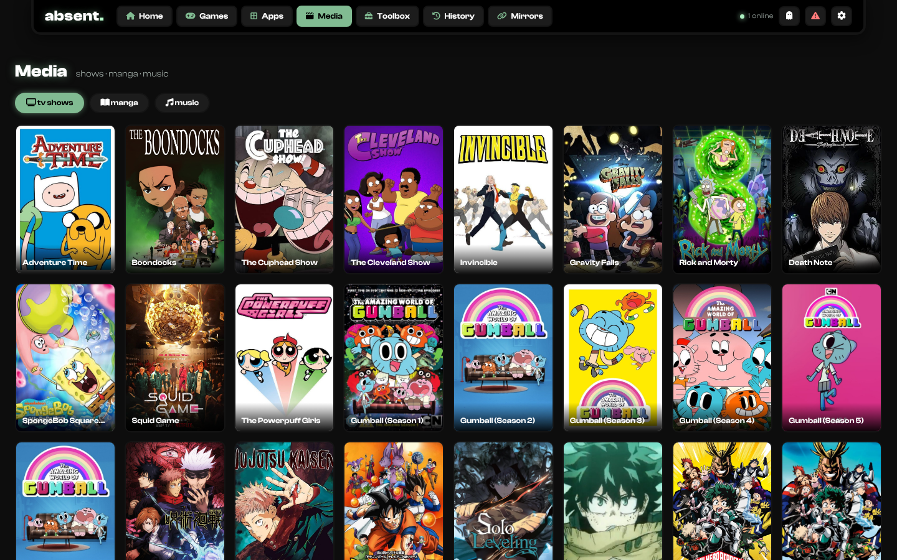
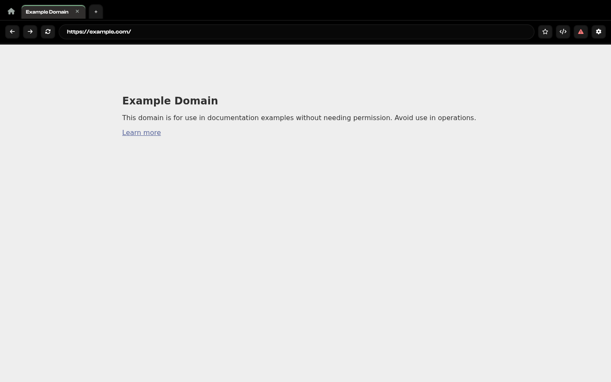
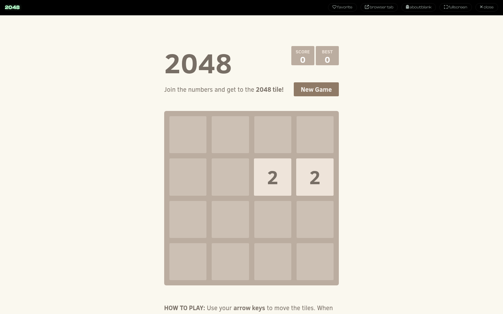

<div align="center">

# absent.

**gone · unseen · unblocked**

**A fast web proxy that feels like an arcade — dark neon skin, Clash Display type, glowing cards, and a fully-loaded stash. Built on a [DayDream X](https://github.com/NxroProxy/DayDreamX) base with a Scramjet + WISP engine.**

absent v6.0 runs 100% in your browser — [Scramjet](https://github.com/MercuryWorkshop/scramjet) + [Epoxy transport](https://github.com/MercuryWorkshop/epoxy-transport) over WISP — wrapped in a dark arcade shell with **399 games** on glowing shelves with real cover art (incl. **Roblox** & 20+ Eaglercraft clients), **55 TV shows + 21 manga**, a **music player**, a **built-in Spotify player**, an **apps desktop**, a **live users-online counter**, a **password-locked toolbox (40+ tools)**, **17 tab cloak presets**, a **fake-classroom stealth cover**, **panic key**, **favorites**, a **game roulette**, **cursor packs**, **animated backgrounds**, **tab cloaking**, history & bookmarks, multi-tab browsing, and automatic low-latency server switching baked in.

[](https://github.com/UnblockableMan/absent)
[](#-license)
[](https://www.tiktok.com/@absent.prxy)

[](https://deploy.workers.cloudflare.com/?url=https://github.com/UnblockableMan/absent)
[](https://render.com/deploy?repo=https://github.com/UnblockableMan/absent)
[](https://vercel.com/new/clone?repository-url=https%3A%2F%2Fgithub.com%2FUnblockableMan%2Fabsent&project-name=absent)
[](https://app.netlify.com/start/deploy?repository=https://github.com/UnblockableMan/absent)

[](https://railway.com/new/template?template=https://github.com/UnblockableMan/absent)
[](https://app.koyeb.com/deploy?type=git&repository=github.com/UnblockableMan/absent&branch=main&builder=dockerfile)
[](https://heroku.com/deploy?template=https://github.com/UnblockableMan/absent)

</div>

---

## 📸 How absent looks

<div align="center">

**The home menu — glowing hero, quick search, game shelves**


**399 games + full media stash**

<table>
<tr>
<td width="50%"><br><sub><b>🎮 Games.</b> Search, category chips, favorites (♥), random-game roulette.</sub></td>
<td width="50%"><br><sub><b>📺 Media.</b> 55 TV shows, 21 manga, lofi music player.</sub></td>
</tr>
</table>

**The Toolbox + stealth settings**

<table>
<tr>
<td width="50%"><br><sub><b>🔒 Toolbox.</b> Password-locked (default <code>4349</code>): calculators, study helpers, bookmarklets, utilities. Reads like school stuff, not cheats.</sub></td>
<td width="50%"><br><sub><b>👻 Settings.</b> 17 cloak presets, custom cloak, about:blank launcher, stealth cover, panic key, cursors, themes.</sub></td>
</tr>
</table>

**Multi-tab proxy browser + in-app game player**

<table>
<tr>
<td width="50%"><br><sub><b>🌐 Browser.</b> Up to 12 tabs, address bar, bookmarks, devtools, panic.</sub></td>
<td width="50%"><br><sub><b>🕹️ Player.</b> Games open in an overlay — pop out, about:blank, or fullscreen.</sub></td>
</tr>
</table>

</div>

---

## ⚡ One-Click Deploy

Run it static (Cloudflare Pages / Netlify / GitHub Pages style) — or with **node** for the built-in WISP server (recommended, zero config):

```bash
git clone https://github.com/UnblockableMan/absent.git
cd absent
npm i
npm start
```

The server binds `PORT` (default `8080`). Opening the site served by node auto-registers `wss://<host>/wisp/` as a first-class server alongside the public ones in `wisps.html`.

---

## ✨ Features

| | |
|---|---|
| 🎮 **399 games** | shelves + grid, real cover art, search, category chips, ♥ favorites, random-game roulette |
| 📺 **Media** | 55 TV shows · 21 manga (opens straight to the goods) · lofi OST player + play your own files |
| 🌐 **Proxy browser** | multi-tab (12), address bar, back/fwd/reload, loading bar, error screen, bookmarks (double-tap ★) |
| 👻 **Tab cloaking** | 17 presets (Classroom, Drive, Gmail, Docs, Canvas, Khan…) + custom title & icon, live favicon swap |
| 🫥 **about:blank** | one-click launcher + optional auto about:blank on first click |
| 🏫 **Stealth cover** | fake Google Classroom overlay — `Ctrl+Shift+D` any time, or auto when the tab loses focus |
| 🚧 **Block screen** | optional fake school-filter page on startup, click-through to enter |
| 🚨 **Panic key** | capture any combo (default `` ` ``), instant redirect anywhere |
| 🔧 **Toolbox** | password-locked (default `4349`): 10 calculators, 7 study helpers, 6 bookmarklets, 18 utilities (code editor, emulators, cloud gaming, XP desktop…) |
| 🎵 **Spotify + apps** | embedded player through the tunnel, YouTube, Twitch, Roblox, Android, Discord |
| 🔗 **Mirrors** | 19 backup links listed in-app, one-tap copy/open |
| 🟢 **Live presence** | users-online counter, live over websocket |
| ⚡ **Server switching** | pings every WISP server, auto-switches to the lowest-latency one, add your own |
| 🎨 **Look engine** | 8 accent colors, animated backgrounds (particles / matrix / stars), custom bg image, 40+ cursor packs + animated Teto, crosshair overlay, perf mode |
| 💾 **Data tools** | export / import everything as json |
| 🛠️ **Devtools** | one-tap Eruda injection into any page |
| 🧪 **Stealth launcher** | `class.html` — a fake Classroom page; joining a "class" with a code boots the site from a mirror in a new tab |

---

## 🧱 Stack

- **Engine** — [Scramjet](https://github.com/MercuryWorkshop/scramjet) + [Epoxy](https://github.com/MercuryWorkshop/epoxy-transport) + [bare-mux](https://github.com/MercuryWorkshop/bare-mux) over [WISP](https://wisp.mercurywork.shop/)
- **Server** — Express + built-in `wisp-js` server (DayDream X skeleton)
- **UI** — single-file app, Clash Display, particles.js, zero build step
- **Fallbacks** — Ultraviolet & libcurl transports still ship for the legacy internal pages

## 🪞 Mirrors

If a link gets blocked, the **Mirrors** page inside the app always has the current list (one-tap copy). Spinning up new mirrors: `tools/spawn-workers.sh` deploys the static build to Cloudflare Workers named `absent-xxxxx` — add the URLs to `MIRROR_LINKS` in `index.html` (base64-encoded) and to `wisps.html` if they also run a WISP server.

## 🔑 Default passwords

| thing | default |
|---|---|
| toolbox | `4349` |
| panic combo | `` ` `` (disabled until you set it) |

Change both in **Settings → Data** / **Settings → Panic**.

---

## ⚠️ Disclaimer

This proxy is provided as-is for educational purposes. You are responsible for how you use it — respect your network's policies and local laws. The authors are not liable for any consequences of misuse.

## 📄 License

Proprietary — see [LICENSE](LICENSE). Cloning for personal use is fine; rebranding and redistributing is not.
